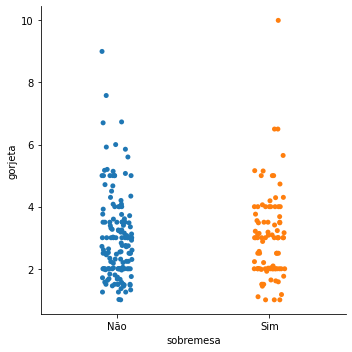
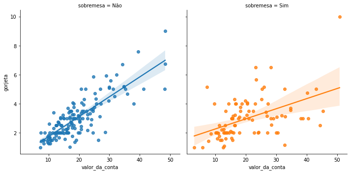
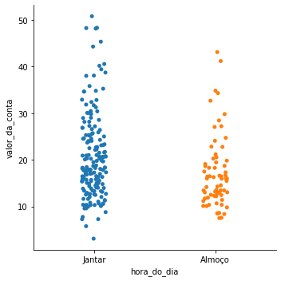
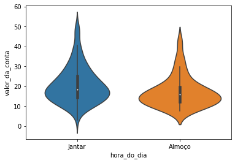
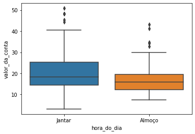

# Estudo da Biblioteca Seaborn

 Estudo da Biblióteca Seaborn com base no curso da Alura   
                   Python para Data Science.

<a href="#sobre"> Sobre - </a>
<a href="#tecnologias">Tecnologias - </a>
<a href="#bibliotecas">Bibliotecas - </a>
<a href="#analises">Análises - </a>
<a href="#autor">Autor</a>

 
<h4 align = "center">
✔️Projeto concluído✔️

# Sobre

 
Esse projeto se trata de gorjetas, e sabemos que no Brasil as pessoas pagam 10% do valor da conta como gorjeta ou caixinha dos funcionários, de forma opcional. Em outros países, este valor é livre e fica a critério do cliente, ou seja, não há uma porcentagem exata estabelecida.

Como não existe a possibilidade de  analisar as gorjetas dadas por todas as pessoas do mundo, será feita uma nálise com uma  amostra com um grupo de pessoas ou registros na base de dados.
Serão Realizadas 04 análises.

# Tecnlogias
* Python
* Jupyter Notebook

# Bibliotecas
* Pandas
* Seaborn
* Ranksums

# Análises

## **Análise 01**

 Segundo o Gráfico de disperção, é possível notar que o valor da gorjeta é maior   em contas com valores altos.
 

### **Verificando se o valor da gorjeta é proporcional ao da conta**

 Apesar do primeiro gráfico indicar que conforme o valor da conta sobe, o valor da gorjeta também sobe   o segundo gráfico indica que essa característica não é proporcional! 
 

## **Análise 02**
Pedir sobremesa altera o valor sa gorjeta ?

 O gráfico categórico não retornou nenhum dado relevante sobre a infliuência da   sobremesa na gorjeta. 
 

 Esse gráfico já aponta uma disperção maior nas gorjetas de contas com sombremesa   
Validar essa análise através de mais 02 gráficos seguintes:

 Visualmente existe uma diferença da gorjeta daqueles que pediram sobremesa para aqueles  
que não pediram sobremesa.

### **Teste de Hipótese**

**Hnull**
- **A distribuição da taxa da gorjeta é a mesma nos dois grupos (Grupo que compra sobremesa e grupo que não compra sobremesa).**

**H<alt>null**
- **A distribuição da taxa da gorjeta não é a mesma nos dois grupos (Grupo que compra sobremesa e grupo que não compra sobremesa).**

**Resultado do  pvalue=0.5. Como esse valor é muito alto, a hipótese alternativa é decartada, logo a hipótese nula prevalece.**

- **A distribuição da taxa da gorjeta é a mesma nos dois grupos (Grupo que compra sobremesa e grupo que não compra sobremesa).**

## **Análise 03**
### **Tem algum dia da Semana que as pessoa dão mais gorjetas?**

 Visualmente as pessoas gastam menos na quinta e na sexta.

### **Análises Descritivas**
* Média geral das gorjetas é de 2.99

  Após a análise ficou visível que a média do valor da gorjeta no domingo é maior do que a do sábado.  Porém, é possível notar que a quantidade de pessoas no restaurante é maior no sábado do que no domingo.  
Os valores das contas nos dois dias são diferentes também?

### **Teste de Hipótese**
**Hnull**
    
- **A distribuição do valor na conta é igual no sábado e no domingo.**
    
**HAlt**
    
- **A distribuição do valor na conta não é igual no sábado e no domingo.**

**Resultado do  pvalue=0.35. Como esse valor é muito alto, a hipótese alternativa é decartada, logo a hipótese nula prevalece.**

- **A distribuição do valor na conta é igual no sábado e no domingo.**

## **Análise 04**

### **A hora do dia influencia no valor da conta ?**

Visualmente, as contas do Jantar são maiores

No gráfico acima fica visível a média de frequência da conta do jantar e do almoço. 
Com ele fica vísivel a diferença de valores na média e na proporção dos valores  
Pro fim é possível concluir que a hora do dia influencia no valor da conta  

# Autor

* Gabriel Barbosa
* 27 Anos
* Estudante de Data Science
* Analista e Desenvolvedor de Sistemas
* Linkedin: https://www.linkedin.com/in/gabriel-barbosa-j/
* Instagram: https://www.instagram.com/gabrielbarbosa.j/